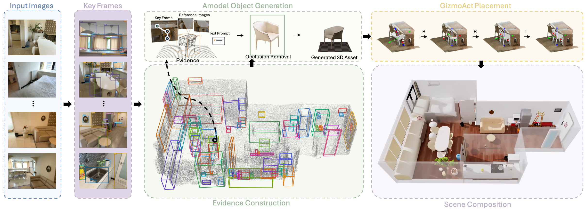

# Lucida: Parse, Generate, and Place for Composable Real-to-Sim Scene Modeling

> arXiv Preprint, 2026

**Authors:** [Minghan Qin](@minghanqin), [Yuang Wang](@yuangwang), [Xiuyu Yang](@xiuyuyang), [Yushi Long](@yushilong), [Yujian Zhang](@yujianzhang), **Ruihuan Wang**, [Kai Ye](@kaiye), [Yangang Zhang](@yangangzhang), [Hang Li](@hangli)

[arXiv](https://arxiv.org/abs/2608.30821) [Project Page](https://lucida-r2s.github.io/) [Hugging Face](https://huggingface.co/papers/2608.30821)
