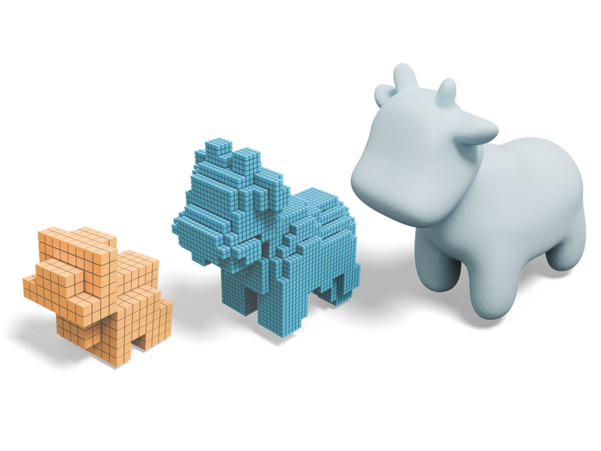

# OctGPT: Octree-based Multiscale Autoregressive Models for 3D Shape Generation

> ACM SIGGRAPH 2025

**Authors:** [Si-Tong Wei](@sitongwei), **Rui-Huan Wang**, [Chuan-Zhi Zhou](@chuanzhizhou), [Baoquan Chen](@baoquanchen), [Peng-Shuai Wang](@pengshuaiwang)

[arXiv](https://arxiv.org/abs/2504.09975) [Code](https://github.com/octree-nn/octgpt)
